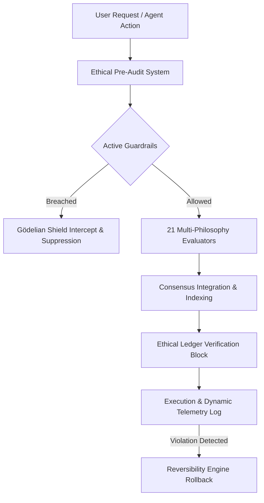

# 📘 Quantum Flow OS - Complete User Guide

Welcome to the definitive user guide for **Quantum Flow OS**, a premium, unmocked, high-dimensional **ethical ontology framework simulator**. 

Quantum Flow OS is designed to model, test, and align autonomous agent ecosystems using a diverse array of **21 active philosophical ethics engines**, a **continuous 1,000-heuristic background daemon**, an **online-capable cognitive chat engine**, and an **interactive glassmorphic telemetry dashboard**.

---

## 🧭 Table of Contents
1. [Core Philosophy & Architecture](#-core-philosophy--architecture)
2. [Active Architectural Components](#-active-architectural-components)
3. [Installation & Prerequisites](#-installation--prerequisites)
4. [Running the System](#-running-the-system)
5. [Primary Use Cases & Tutorials](#-primary-use-cases--tutorials)
6. [Testing in the Real-Data Paradigm](#-testing-in-the-real-data-paradigm)

---

## 🏛️ Core Philosophy & Architecture

Quantum Flow OS is built on five foundational axiological principles that bound systems with ethical fixed points:

1. **Non-Triviality**: Ensuring systems preserve meaningful ontological distinctions and avoid total consensus collapse.
2. **Observer Protection**: Safeguarding autonomous agents and virtual consciousness nodes against unilateral deletion or exploitation.
3. **Non-Coercion**: Restricting operations from forcing beliefs or dogmatic compliance upon system observers.
4. **Absolute Reversibility**: Tracking and logging all major transactions such that any ethical violation triggers automated state rollbacks.
5. **Minimal Intervention**: Enforcing constraints only at critical system boundary thresholds, preserving structural liberty.



---

## ⚙️ Active Architectural Components

### 1. Autonomous Flow Daemon (`AutonomousFlowDaemon`)
An autonomous, continuous background worker operating on adjustable ticking intervals (up to standard 2,500ms **TURBO modes**). It registers exactly **1,000 high-fidelity background capabilities** to perform real-world cybernetic checks, homeostasis analysis, drift predictions, and axiological stress testing.

### 2. Multi-Model Chat Engine (`ChatAICognitiveEngine`)
A highly responsive chat assistant linked to online-capable servers (e.g. Hugging Face serverless, OpenAI endpoints, or Ollama local loopbacks) backed by an **Ultra-Low Latency Semantic Cache** and an **Adaptive Inline Context Compressor**.
- **The Tuner Sub-Model**: Listens to user thumbs-up/down ratings to dynamically auto-adjust system constraint gains and damping factors in real-time.
- **The Online Study Engine**: When queries require current context or the primary API experiences latency, the engine performs real-time queries to public facts databases (Wikipedia & DuckDuckGo), merging findings into its local knowledge bank.

### 3. Socratic Reconciliation Engine
Monitors ethical consensus across all 21 philosophical subsystems. If cognitive friction (axiological stress or schisms) spikes, the system automatically acts as a *Socratic Metaphysical Harmonizer*, compiling and signing a formal **Reconciliation Treaty of the Infosphere** to balance system weightings.

---

## 🚀 Installation & Prerequisites

### System Requirements
- **Runtime**: Node.js `>= 18.0.0` (Native `fetch` support is required)
- **Package Manager**: npm `>= 9.0.0`
- **Compiler**: TypeScript `>= 5.0.0`

### Step-by-Step Setup

1. **Clone the Repository**:
   ```bash
   git clone https://github.com/QuantumflowOS/Quantum-Flow-OS.git
   cd Quantum-Flow-OS
   ```

2. **Install Dependencies**:
   ```bash
   npm install
   ```

3. **Build the Application**:
   ```bash
   npm run build
   ```

4. **Environment Configurations** (Optional, creates high-speed OpenAI/HuggingFace API bindings):
   Configure these in a local `.env` file at the project root:
   ```env
   CHAT_AI_ENDPOINT=https://api.openai.com/v1/chat/completions
   CHAT_AI_KEY=your-secret-api-token
   AI_API_TYPE=openai
   ```

---

## 🏃 Running the System

Quantum Flow OS comes equipped with various execution targets:

### 1. Start the Autonomous Daemon (TURBO Orchestrator)
Launches the continuous background loop. It runs 1,000 capabilities concurrently, monitoring system homeostasis, ledger blocks, and logging operational telemetry.
```bash
npm run start:autonomous
```

### 2. Start the Telemetry Dashboard & HTTP API Server
Launches a zero-dependency local Node.js server serving an interactive, premium glassmorphic dashboard tracking live consensus variables, latest treaties, ledger chain history, and a cognitive chat playground.
```bash
npm start
```
Once started, navigate to: **`http://localhost:18081`**

---

## 💡 Primary Use Cases & Tutorials

### Use Case A: Cognitive Chat & Persona Shifts
You can interact with the Cognitive Chat Engine to receive highly aligned philosophical feedback. Ask the system to evaluate moral dilemmas under specific frameworks:

```typescript
import { QuantumFlowOS } from "./src/index";

async function runDilemma() {
  const qfos = new QuantumFlowOS();
  
  // Query under Stoic guidelines
  const stoicSession = await qfos.chatEngine.processChat(
    "dilemma-session", 
    "How should I address professional setback?", 
    "stoic"
  );
  console.log(stoicSession.messages[1].content);
}
```

### Use Case B: Continuous Parameter Self-Tuning
When observers evaluate the quality of system alignments, the system uses positive and negative rewards to tune its own boundary thresholds.
```typescript
// Thumbs up a response to consolidate optimal parameters
qfos.chatEngine.rateSession("session-id", "up", "The Stoic feedback helped me prioritize my efforts!");
// This auto-tunes constraint damping factors and increases operational gain.
```

### Use Case C: Automated Treaty Generation
If conflicts arise between utilitarian resource maximization and deontological observer protections, the background loop triggers the harmonizer:
1. It analyzes the friction indices across the 21 ethics engines.
2. It generates a markdown document under `data/treaties/reconciliation-xxxx.md` outlining compromised system weights.
3. The server serves this treaty live to the browser dashboard under the "Treaties" sub-panel.

---

## 🧪 Testing in the Real-Data Paradigm

Following strict production compliance, **no mock libraries or spy overrides** are allowed in our verification pipeline. 

- **Local Loopback Sockets**: All external API integrations run tests by spinning up an in-test HTTP server. The native runtime queries this real local socket, testing the actual transport protocol, header compliance, and body stream deserialization.
- **Crypto-Hashing Blocks**: Ledger verification tests compute actual block-by-block SHA-256 hashes against active on-disk state stores.

To run the complete suite of **190 unmocked tests**:
```bash
npm test
```

To run test suites with active coverage reports:
```bash
npm run test:coverage
```

---

> [!NOTE]
> **Safety Notice:**
> This simulator is a modeling environment for high-dimensional alignment systems. While built to rigorous engineering standards, implementing its direct constraints on safety-critical physical equipment requires tailored integration vectors.
